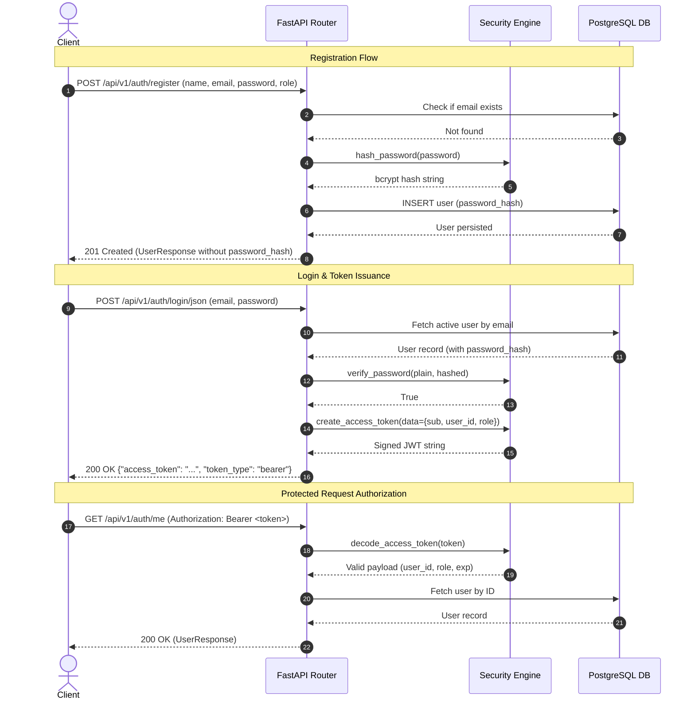

# 🔑 Authentication Guide

This document details the authentication architecture, password hashing mechanism, JSON Web Token (JWT) lifecycle, and security controls in the ElderCare ChatBot backend.

---

## 🛡️ Security Architecture Overview

The authentication system is built around standard, industry-proven cryptographic primitives:
* **Password Hashing**: Direct `bcrypt` hashing with auto-generated salts.
* **Token Standard**: JSON Web Tokens (JWT) signed via HMAC-SHA256 (`HS256`).
* **Statelessness**: Tokens carry minimal required claims (`sub`, `user_id`, `role`, `exp`), requiring no session-state storage on the backend while allowing fast local verification.
* **Zero Leakage**: Password hashes are strictly omitted from all Pydantic response schemas, logs, and error traces.



---

## 🔒 Password Hashing Standard

Password security is implemented in [`src/core/security.py`](file:///d:/ElderCareChatBot/src/core/security.py):

* **Direct Bcrypt**: Rather than relying on legacy passlib abstractions with deprecated internal modules, we utilize pure `bcrypt` routines:
  ```python
  def hash_password(password: str) -> str:
      pwd_bytes = password.encode("utf-8")
      salt = bcrypt.gensalt()
      return bcrypt.hashpw(pwd_bytes, salt).decode("utf-8")

  def verify_password(plain_password: str, hashed_password: str) -> bool:
      return bcrypt.checkpw(
          plain_password.encode("utf-8"),
          hashed_password.encode("utf-8"),
      )
  ```
* **Validation**: User passwords require a minimum of 8 characters enforced at schema level via Pydantic (`min_length=8`).

---

## 🎫 JWT Access Token Lifecycle

### Token Structure
JWT tokens generated by [`create_access_token`](file:///d:/ElderCareChatBot/src/core/security.py#L32) encode a standard claims dictionary:
* `sub`: User's registered email address (e.g. `sarah.nurse@eldercare.test`).
* `user_id`: Integer primary key of the user in the database.
* `role`: User's access tier (`admin` or `caregiver`).
* `exp`: Expiration Unix timestamp in UTC.

### Configuration
Key settings are managed in `.env` via [`src/core/config.py`](file:///d:/ElderCareChatBot/src/core/config.py):
* `SECRET_KEY`: High-entropy cryptographic string used to sign and verify HMAC tokens.
* `JWT_ALGORITHM`: Cryptographic signature algorithm (default: `HS256`).
* `ACCESS_TOKEN_EXPIRE_MINUTES`: Token lifetime in minutes (default: `30`).

### Expiration & Invalidation
* Tokens automatically expire once the current time exceeds `exp`.
* Requests with expired or modified tokens are immediately rejected with `401 Unauthorized` and header `WWW-Authenticate: Bearer`.
* If a user is deactivated or soft-deleted (`deleted_at IS NOT NULL`), [`get_current_user`](file:///d:/ElderCareChatBot/src/api/deps.py#L30) immediately rejects the request with HTTP 401 even if the JWT has not yet expired.

---

## 🚀 Dual Login Mechanisms

To accommodate both web frontend SPAs/mobile apps and Swagger UI testing, the backend provides two distinct endpoints:

### 1. JSON REST Login (`POST /api/v1/auth/login/json`)
Designed for REST clients, SPAs, and mobile applications:
```json
{
  "email": "caregiver@eldercare.test",
  "password": "Password123!"
}
```

### 2. OAuth2 Password Form (`POST /api/v1/auth/login`)
Complies with the OpenAPI / OAuth2 Password Flow standard (`application/x-www-form-urlencoded`):
* `username`: User email
* `password`: Plaintext password
Used directly by the `/docs` Swagger interface "Authorize" button.
