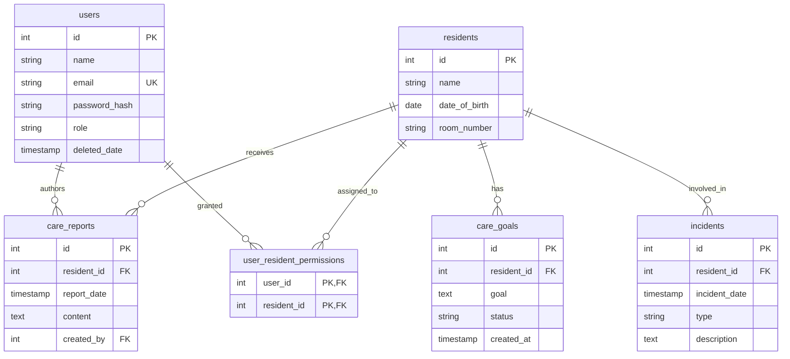

# ElderCareChatBot Database, Schemas, and CRUD Architecture

## 1. Overview & Architectural Principles

The ElderCareChatBot backend establishes a clean, decoupled foundation designed for FastAPI, Pydantic v2, and SQLAlchemy 2.0.

The architecture enforces strict separation of concerns across layers:

```text
Database Tables (PostgreSQL)
            ↕
SQLAlchemy ORM Models (src/models/)
            ↕
CRUD Operations Layer (src/crud/)
            ↕
Pydantic Schemas (src/schemas/)
            ↕
FastAPI Routers / Endpoints
```

* **SQLAlchemy Models**: Represent database tables, columns, indexes, foreign keys, and relationships.
* **Pydantic Schemas**: Define API contracts, request payload validation, and secure serialization (`from_attributes=True`).
* **CRUD Modules**: Encapsulate all database queries, insertions, partial updates, and deletions using SQLAlchemy `Session`.

---

## 2. Entity-Relationship (ER) Diagram



---

## 3. Database Models Reference (`src/models/`)

All models inherit from `src.database.Base` (`DeclarativeBase`).

### 3.1. `User` (`src/models/user.py`)
* **Table Name**: `users`
* **Columns**:
  * `id`: `INTEGER`, Primary Key, indexed, auto-incrementing.
  * `name`: `VARCHAR(100)`, non-nullable, indexed.
  * `email`: `VARCHAR(255)`, non-nullable, unique, indexed.
  * `password_hash`: `TEXT`, non-nullable (never plaintext).
  * `role`: `VARCHAR(20)`, non-nullable, default `"caregiver"`.
  * `deleted_date`: `TIMESTAMP` (`DateTime`), nullable (soft-delete indicator).
* **Relationships**:
  * `care_reports`: One-to-many relationship with `CareReport`.
  * `user_resident_permissions`: One-to-many relationship with `UserResidentPermission`.

### 3.2. `Resident` (`src/models/resident.py`)
* **Table Name**: `residents`
* **Columns**:
  * `id`: `INTEGER`, Primary Key, indexed.
  * `name`: `VARCHAR(100)`, non-nullable, indexed.
  * `date_of_birth`: `DATE`, nullable.
  * `room_number`: `VARCHAR(20)`, nullable.
* **Relationships**:
  * `care_reports`: One-to-many with `CareReport`.
  * `care_goals`: One-to-many with `CareGoal`.
  * `incidents`: One-to-many with `Incident`.
  * `user_resident_permissions`: One-to-many with `UserResidentPermission`.

### 3.3. `CareReport` (`src/models/care_report.py`)
* **Table Name**: `care_reports`
* **Columns**:
  * `id`: `INTEGER`, Primary Key, indexed.
  * `resident_id`: `INTEGER`, Foreign Key (`residents.id`), non-nullable.
  * `created_by`: `INTEGER`, Foreign Key (`users.id`), nullable.
  * `report_date`: `TIMESTAMP` (`DateTime`), non-nullable, default UTC now.
  * `content`: `TEXT`, non-nullable.
* **Relationships**:
  * `resident`: Many-to-one with `Resident`.
  * `user`: Many-to-one with `User`.

### 3.4. `CareGoal` (`src/models/care_goal.py`)
* **Table Name**: `care_goals`
* **Columns**:
  * `id`: `INTEGER`, Primary Key, indexed.
  * `resident_id`: `INTEGER`, Foreign Key (`residents.id`), non-nullable.
  * `goal`: `TEXT`, non-nullable.
  * `status`: `VARCHAR(30)`, non-nullable, default `"active"`.
  * `created_at`: `TIMESTAMP` (`DateTime`), non-nullable, default UTC now.
* **Relationships**:
  * `resident`: Many-to-one with `Resident`.

### 3.5. `Incident` (`src/models/incident.py`)
* **Table Name**: `incidents`
* **Columns**:
  * `id`: `INTEGER`, Primary Key, indexed.
  * `resident_id`: `INTEGER`, Foreign Key (`residents.id`), non-nullable.
  * `incident_date`: `TIMESTAMP` (`DateTime`), non-nullable, default UTC now.
  * `type`: `VARCHAR(50)`, non-nullable.
  * `description`: `TEXT`, non-nullable.
* **Relationships**:
  * `resident`: Many-to-one with `Resident`.

### 3.6. `UserResidentPermission` (`src/models/user_resident_permission.py`)
* **Table Name**: `user_resident_permissions`
* **Columns**:
  * `user_id`: `INTEGER`, Foreign Key (`users.id`), Primary Key.
  * `resident_id`: `INTEGER`, Foreign Key (`residents.id`), Primary Key.
  * **Composite Primary Key**: `(user_id, resident_id)`.
* **Relationships**:
  * `user`: Many-to-one with `User`.
  * `resident`: Many-to-one with `Resident`.

---

## 4. Pydantic Schemas Reference (`src/schemas/`)

Every entity defines `<Entity>Base`, `<Entity>Create`, `<Entity>Update`, and `<Entity>Response`.

| Schema Class | Key Fields & Validations | Notes |
| :--- | :--- | :--- |
| `UserCreate` | `name` (1-100), `email` (EmailStr), `password` (min 6), `role` (default 'caregiver') | Used during user registration |
| `UserUpdate` | `name`, `email`, `role`, `password` (all optional) | Partial updates via `model_dump(exclude_unset=True)` |
| `UserResponse` | `id`, `name`, `email`, `role`, `deleted_date` | **Omits `password_hash`**; `from_attributes=True` |
| `ResidentCreate` | `name` (1-100), `date_of_birth` (date, optional), `room_number` (optional) | Validates resident admission data |
| `ResidentUpdate` | `name`, `date_of_birth`, `room_number` (all optional) | Partial updates |
| `ResidentResponse`| `id`, `name`, `date_of_birth`, `room_number` | Serializes database records |
| `CareReportCreate`| `resident_id`, `content` (min 1), `created_by` (optional), `report_date` (optional) | Custom or auto-timestamp |
| `CareReportUpdate`| `content`, `report_date` (optional) | Modifies report text or timestamp |
| `CareReportResponse`| `id`, `resident_id`, `report_date`, `content`, `created_by` | Clinical notes serialization |
| `CareGoalCreate` | `resident_id`, `goal` (min 1), `status` (default 'active') | Sets new goals |
| `CareGoalUpdate` | `goal`, `status` (optional) | Transitions status (e.g. to 'achieved') |
| `CareGoalResponse`| `id`, `resident_id`, `goal`, `status`, `created_at` | Serializes care goals |
| `IncidentCreate` | `resident_id`, `type` (1-50), `description` (min 1), `incident_date` (optional) | Records incident reports |
| `IncidentUpdate` | `type`, `description`, `incident_date` (all optional) | Updates incident details |
| `IncidentResponse`| `id`, `resident_id`, `type`, `description`, `incident_date` | Incident log serialization |
| `UserResidentPermissionCreate` | `user_id`, `resident_id` | Associates caregiver with resident |
| `UserResidentPermissionResponse` | `user_id`, `resident_id` | Returns permission link |

---

## 5. CRUD Operations Reference (`src/crud/`)

All CRUD functions receive a SQLAlchemy `Session` instance as their first argument.

### User Operations (`src/crud/user.py`)
* `create_user(db, user_data: UserCreate, password_hash: str | None = None) -> User`
* `get_user_by_id(db, user_id: int, include_deleted: bool = False) -> User | None`
* `get_user_by_email(db, email: str, include_deleted: bool = False) -> User | None`
* `get_users(db, skip: int = 0, limit: int = 100, include_deleted: bool = False) -> list[User]`
* `update_user(db, user_id: int, user_data: UserUpdate, password_hash: str | None = None) -> User | None`
* `delete_user_soft(db, user_id: int) -> User | None`
* `delete_user_hard(db, user_id: int) -> bool`

### Resident Operations (`src/crud/resident.py`)
* `create_resident(db, resident_data: ResidentCreate) -> Resident`
* `get_resident_by_id(db, resident_id: int) -> Resident | None`
* `get_all_residents(db, skip: int = 0, limit: int = 100) -> list[Resident]`
* `update_resident(db, resident_id: int, resident_data: ResidentUpdate) -> Resident | None`
* `delete_resident(db, resident_id: int) -> bool`

### Care Report Operations (`src/crud/care_report.py`)
* `create_care_report(db, report_data: CareReportCreate) -> CareReport`
* `get_care_report_by_id(db, report_id: int) -> CareReport | None`
* `get_care_reports_by_resident(db, resident_id: int, skip: int = 0, limit: int = 100) -> list[CareReport]`
* `get_all_care_reports(db, skip: int = 0, limit: int = 100) -> list[CareReport]`
* `update_care_report(db, report_id: int, report_data: CareReportUpdate) -> CareReport | None`
* `delete_care_report(db, report_id: int) -> bool`

### Care Goal Operations (`src/crud/care_goal.py`)
* `create_care_goal(db, goal_data: CareGoalCreate) -> CareGoal`
* `get_care_goal_by_id(db, goal_id: int) -> CareGoal | None`
* `get_care_goals_by_resident(db, resident_id: int, status: str | None = None, skip: int = 0, limit: int = 100) -> list[CareGoal]`
* `get_all_care_goals(db, skip: int = 0, limit: int = 100) -> list[CareGoal]`
* `update_care_goal(db, goal_id: int, goal_data: CareGoalUpdate) -> CareGoal | None`
* `delete_care_goal(db, goal_id: int) -> bool`

### Incident Operations (`src/crud/incident.py`)
* `create_incident(db, incident_data: IncidentCreate) -> Incident`
* `get_incident_by_id(db, incident_id: int) -> Incident | None`
* `get_incidents_by_resident(db, resident_id: int, skip: int = 0, limit: int = 100) -> list[Incident]`
* `get_all_incidents(db, skip: int = 0, limit: int = 100) -> list[Incident]`
* `update_incident(db, incident_id: int, incident_data: IncidentUpdate) -> Incident | None`
* `delete_incident(db, incident_id: int) -> bool`

### User-Resident Permission Operations (`src/crud/user_resident_permission.py`)
* `create_user_resident_permission(db, permission_data: UserResidentPermissionCreate) -> UserResidentPermission`
* `get_user_resident_permission(db, user_id: int, resident_id: int) -> UserResidentPermission | None`
* `get_permissions_by_user(db, user_id: int) -> list[UserResidentPermission]`
* `get_permissions_by_resident(db, resident_id: int) -> list[UserResidentPermission]`
* `get_all_user_resident_permissions(db, skip: int = 0, limit: int = 100) -> list[UserResidentPermission]`
* `delete_user_resident_permission(db, user_id: int, resident_id: int) -> bool`

---

## 6. Key Fixes & Architectural Decisions

1. **SQLAlchemy 2.0 Base Class**:
   - In `src/database.py`, replaced `class Base(declarative_base):` (which failed with `TypeError`) with `class Base(DeclarativeBase):`.
2. **Modular Directory Structure**:
   - Deconstructed monolithic `src/models.py` into individual, dedicated model files in `src/models/` (`user.py`, `resident.py`, `care_report.py`, `care_goal.py`, `incident.py`, `user_resident_permission.py`).
   - Cleanly re-exported all models in `src/models/__init__.py`.
3. **Composite Primary Key Fix**:
   - The original `crud/user_resident_permission.py` attempted to filter by `UserResidentPermission.id == user_resident_permission_id`.
   - Updated CRUD to properly use the composite primary key `(user_id, resident_id)`.
4. **SQLAlchemy Boolean Filter Bug Fix**:
   - Fixed queries that used Python's `and` keyword (e.g. `.filter(User.id == user_id and User.deleted_date.is_(None))`), which incorrectly dropped the first clause. Converted to standard SQLAlchemy multiple clauses: `.filter(User.id == user_id, User.deleted_date.is_(None))`.
5. **Secure User Serialization & Decoupled Auth**:
   - `UserResponse` strictly omits `password_hash` to guarantee sensitive credentials are never serialized.
   - `create_user` and `update_user` support optional `password_hash` parameters for seamless integration with future hashing utilities (e.g., bcrypt).
6. **Environment-Resilient `EmailStr`**:
   - Implemented a fallback in `src/schemas/user.py` using `typing.Annotated` with regex `StringConstraints` so email validation operates reliably even if optional `email-validator` is not installed.

---

## 7. Running Tests

The test suite uses Python's built-in `unittest` framework with isolated in-memory SQLite instances.

To run the complete test suite:

```powershell
.\venv\Scripts\python -m unittest discover -s tests -p "test_*.py" -v
```

All 31 unit tests cover:
* Model creation and foreign key constraints
* Pydantic schema validation and field limits
* Password protection and serialization guarantees
* Soft and hard deletion semantics
* Composite primary key resolution
